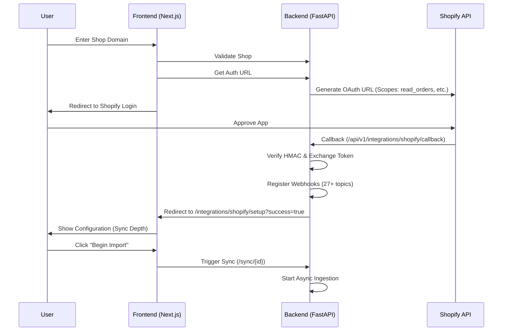

# Shopify Integration: End-to-End Architecture

This document provides a comprehensive technical overview of the Shopify integration, covering the entire flow from the frontend UI to the backend architecture, data models, and verification procedures.

**Last Updated:** 2026-01-13
**Status:** Production Ready

---

## 1. High-Level Architecture

The integration follows a "Safe Handshake" pattern where the frontend initiates the connection, redirects the user to Shopify for OAuth, and then resumes the flow to configure the initial sync.

---

## 2. Frontend Implementation

### Key Components

| Component | Path | Purpose |
|-----------|------|---------|
| `ShopifySetupModal` | `components/integrations/ShopifySetupModal.tsx` | Initial entry point. Validates domain and redirects to Auth URL. |
| `ShopifySetupPage` | `app/integrations/shopify/setup/page.tsx` | Full-page flow for post-OAuth configuration (Sync depth selection). |
| `shopifyApi` | `lib/api/shopify.ts` | API wrapper for backend endpoints. |

### 2.1 Domain Validation & Handshake (`ShopifySetupModal`)

1.  **Input:** User enters `my-store.myshopify.com` (or just `my-store`).
2.  **Sanitization:** Input is cleaned to remove `https://`, `/admin`, etc.
3.  **Validation:** Calls `shopifyApi.validateShopDomain` (Endpoint: `/integrations/shopify/validate-shop`).
4.  **Auth Redirect:** Calls `shopifyApi.getAuthUrl` which returns the signed Shopify OAuth URL.
5.  **Navigation:** `window.location.href = authUrl`.

### 2.2 Post-Auth Configuration (`ShopifySetupPage`)

1.  **Landing:** User is redirected back here with `?success=true&shop=...` after successful backend OAuth.
2.  **Context:** The component uses `listIntegrations` to find the newly created `integration_id` using the shop URL.
3.  **Configuration:** User selects sync range:
    *   3 Months (Fast)
    *   12 Months (Recommended)
    *   All Time (Full History)
4.  **Trigger:** calls `shopifyApi.triggerSync(integrationId, companyId, months)`.

---

## 3. Backend Implementation

### Key Services

| Service | Path | Purpose |
|---------|------|---------|
| `ShopifyOAuthService` | `services/shopify/oauth_service.py` | Handles OAuth flow, token exchange, and webhook registration. |
| `ShopifySyncService` | `services/shopify/sync_service.py` | Implementation of `fetch_and_ingest_*` logic for all resources. |
| `ShopifyAuthEndpoints`| `api/v1/endpoints/shopify_auth.py` | Routes for auth URL, callback, and validation. |

### 3.1 OAuth & Security

*   **Scopes:** We request 13 read-only scopes including `read_orders`, `read_products`, `read_inventory`, `read_reports`, etc.
*   **Encryption:** Access tokens are encrypted using Fernet (AES-128 base) before storage in `integration.credentials`.
*   **HMAC Verification:** All callbacks and webhooks verify the `X-Shopify-Hmac-Sha256` header.

### 3.2 Webhook Registration

Immediately after token exchange, the system automatically registers **27+ webhooks** including:

*   **Core:** `orders/*`, `products/*`, `customers/*`
*   **Inventory:** `inventory_levels/*`, `inventory_items/*` (NEW: Critical for cost updates)
*   **Financial:** `order_transactions/*` (NEW), `refunds/*`, `payouts/*`

### 3.3 Data Ingestion Architecture

The backend uses a **Two-Layer Architecture**:

1.  **Raw Layer (`shopify_raw_ingest`)**
    *   **Purpose:** Immutable audit log. Stores exact JSON from Shopify.
    *   **Deduplication:** Uses `dedupe_hash_canonical` (SHA-256 of sorted JSON) to prevent duplicate processing.
    *   **Fields:** `shopify_object_id`, `object_type`, `source` (webhook/backfill), `processing_status`.

2.  **Refined Layer (`shopify_order`, `shopify_product`, etc.)**
    *   **Purpose:** Clean, relational data for application use.
    *   **Process:** A refinement service listens to new raw records and updates these tables.
    *   **Constraints:** One-to-one mapping with source objects (e.g., `shopify_order` has unique `shopify_order_id` per integration).

---

## 4. Sync & Webhooks

### 4.1 Sync Logic

*   **Pagination:** Uses Cursor-based pagination (`page_info`) for robust deep-paging.
*   **Rate Limits:** Implements exponential backoff strategy for `429 Too Many Requests`.
*   **Deep Fetching:**
    *   For Orders: Fetches `transactions`, `fulfillments`, and `refunds` via the Order API if needed (though dedicated endpoints exist).
    *   For Payouts: Fetches associated `balance_transactions`.

### 4.2 Webhook Handling

*   **Endpoint:** `/api/v1/integrations/shopify/webhooks/{topic}`
*   **Latency:** Processed in near real-time (<5s).
*   **Flow:**
    1.  Receive POST.
    2.  Verify HMAC.
    3.  Ingest to `shopify_raw_ingest` with `source='webhook'`.
    4.  Trigger `refinement_service` (Async).
    5.  Return `200 OK` to Shopify.
*   **Missing Webhooks Strategy:**
    *   **Balance Transactions:** No webhook exists. Synced via `payouts/create` webhook (fetching all txns for the new payout).

---

## 5. Verification & QA

### 5.1 Automated Verification Script

Script: `backend/scripts/verify_shopify_integrity.py`

*   **Function:** Compares live Shopify API counts vs Local DB counts.
*   **Checks:**
    *   Scope Coverage (13/13)
    *   Webhook Status (Active)
    *   Deduplication Integrity (Unique hashes)
    *   Data Accuracy (1-to-1 match)

### 5.2 Manual QA Checklist

- [ ] **Handshake:** Connect a store, verify redirect to `/setup`.
- [ ] **Config:** Select "3 Months", verify sync starts.
- [ ] **Real-time:** Create a generic order in Shopify → Verify it appears in Dashboard < 5s.
- [ ] **Inventory:** Update product cost → Verify `inventory_item` update via webhook.
- [ ] **Integrity:** Run `verify_shopify_integrity.py` returning "HEALTHY".

---

## 6. Component Reference

### Frontend
*   **Dialogs:** `ShopifySetupModal` (Step 1), `ShopifySuccessModal` (Legacy/Alt).
*   **Pages:** `/integrations/shopify/setup` (Step 2).
*   **State:** `onboarding-context.tsx` (tracks setup progress).

### Backend Models
*   `app/models/shopify/order.py` (Orders, LineItems, Refunds)
*   `app/models/shopify/product.py` (Products, Variants, Images)
*   `app/models/shopify/inventory.py` (Levels, Items, Locations)
*   `app/models/shopify/financials.py` (Payouts, Disputes, BalanceTxns)

---

**Maintained By:** Engineering Team
**Related:** [QA Blueprint](datasource_qa_blueprint.md), [Webhook Analysis](shopify_webhook_analysis.md)
